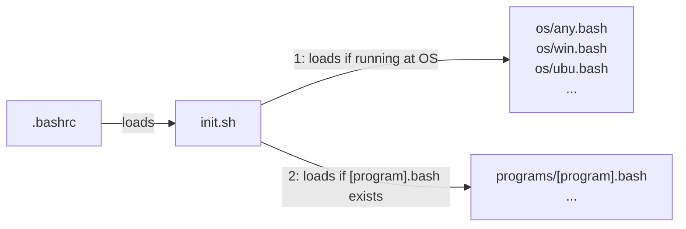
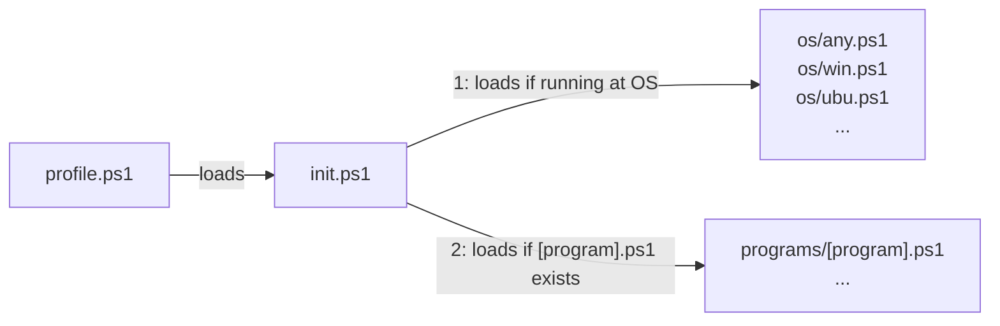

# ps-sh-helpers

`ps-sh-helpers` is way to organise your PowerShell and Bash helper scripts. It organise helper scripts in OS-dependent from `os/<os>.*` files and loads program-dependent from `programs/<program>.*` files. It is initialized at `.bashrc` by loading `init.sh` or at `PowerShell_profile.ps1` by loading `init.ps1` (see diagram below).

**from bash:**



**from powershell:**



## Setup at your bash profile

You can use the Bash commands below to fetch, install, and setup `ps-sh-helpers` to be loaded in your `.bashrc`:

```bash
git clone https://github.com/alanlivio/ps-sh-helpers ~/.ps1-sh-helpers
echo "source ~/.ps-sh-helpers/init.sh" >> ~/.bashrc
```

## Setup at your PowerShell profile

You can use the PowerShell commands below to fetch, install, and setup `ps-sh-helpers`  to be loaded in your `profile.ps1`:

```ps1
git clone https://github.com/alanlivio/ps-sh-helpers ${env:userprofile}\.ps1-sh-helpers
$contentAdd = '. "${env:userprofile}\.ps-sh-helpers\init.ps1""'
Set-Content "${env:userprofile}/Documents/WindowsPowerShell/Microsoft.PowerShell_profile.ps1" $contentAdd 
```

Pay attention that to setup a PowerShell >= 6, the last line should be:
`Set-Content "${env:userprofile}/Documents/PowerShell/profile.ps1" $contentAdd`

## References

This project takes inspiration from:

* <https://github.com/Bash-it/bash-it>
* <https://github.com/milianw/shell-helpers>
* <https://github.com/wd5gnr/bashrc>
* <https://github.com/martinburger/bash-common-helpers>
* <https://github.com/jonathantneal/git-bash-helpers>
* <https://github.com/donnemartin/dev-setup>
* <https://github.com/aspiers/shell-env>
* <https://github.com/nafigator/bash-helpers>
* <https://github.com/TiSiE/BASH.helpers>
* <https://github.com/midwire/bash.env>
* <https://github.com/e-picas/bash-library>
* <https://github.com/awesome-windows11/windows11>
* <https://github.com/99natmar99/Windows-11-Fixer>
* <https://github.com/W4RH4WK/Debloat-windows-10/tree/master/scripts>
