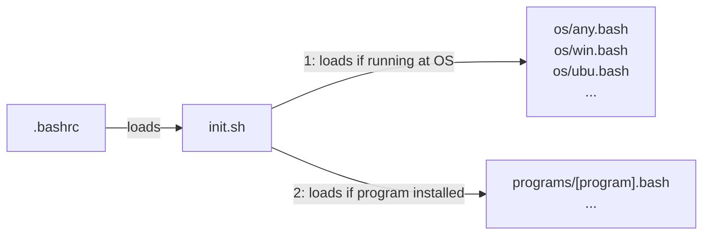
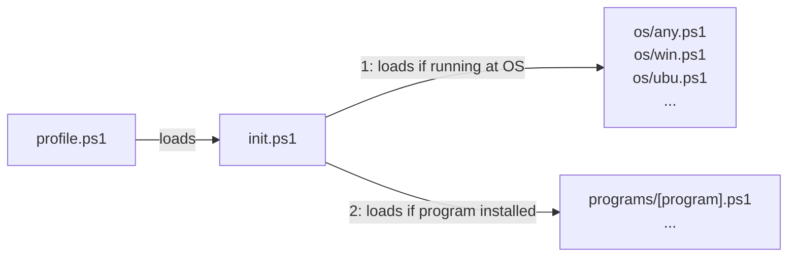

# ps-sh-helpers

`ps-sh-helpers` ps-sh-helpers is library to organise your PowerShell and Bash helper scripts. It organise them in OS-dependent from `os/` files and program-dependent from `programs/` files. It is initialized at `.bashrc` by loading `init.sh` or at `profile.ps1` by loading `init.ps1` (see diagram below).

**from bash:**



**from powershell:**



## Setup at your bash profile

You can use the Bash commands below to fetch, install, and setup `ps-sh-helpers` to be loaded in your `.bashrc`:

```bash
git clone https://github.com/alanlivio/ps-sh-helpers ~/ps-sh-helpers
. ~/ps-sh-helpers/setup_profile_loading.ps1
```

## Setup at your PowerShell profile

You can use the PowerShell commands below to fetch, install, and setup `ps-sh-helpers` to be loaded in your `profile.ps1`:

```bash
git clone https://github.com/alanlivio/ps-sh-helpers ${env:userprofile}\ps1-sh-helpers
. ~/ps-sh-helpers/setup_profile_loading.sh
```

## References

This project takes inspiration from:

- <https://github.com/Bash-it/bash-it>
- <https://github.com/milianw/shell-helpers>
- <https://github.com/wd5gnr/bashrc>
- <https://github.com/martinburger/bash-common-helpers>
- <https://github.com/jonathantneal/git-bash-helpers>
- <https://github.com/donnemartin/dev-setup>
- <https://github.com/aspiers/shell-env>
- <https://github.com/nafigator/bash-helpers>
- <https://github.com/TiSiE/BASH.helpers>
- <https://github.com/midwire/bash.env>
- <https://github.com/e-picas/bash-library>
- <https://github.com/awesome-windows11/windows11>
- <https://github.com/99natmar99/Windows-11-Fixer>
- <https://github.com/W4RH4WK/Debloat-windows-10/tree/master/scripts>
